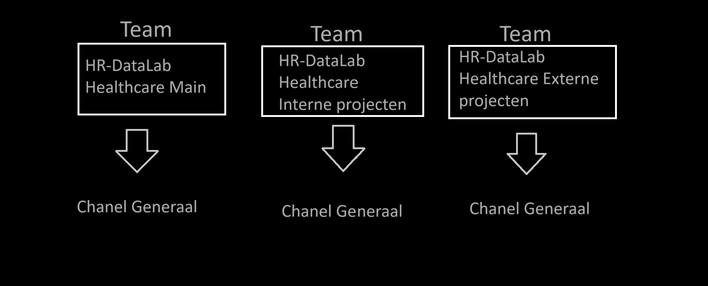
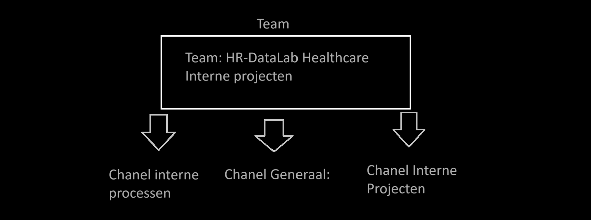

# Komt-een-lector-bij-de-dokter

  

### Hier wordt beschreven hoe Teams en Chanels Praktisch worden gebruikt voor lectoren die komen werken bij ons in het DataLab.

    

- ## Team: HR-DataLab Healthcare Main
   - Chanel Generaal:
     - Notulen van besprekingen
     - updates via posts

    

- ## Team: HR-DataLab Healthcare Interne projecten
  - Chanel Generaal:
     - Roadmap inzicht over alle interne projecten
     - interne processen vastleggen via word documents zoals "in dienst nemen" 
     - interne projecten (roadmap overzicht van project zelf)   
    

       

- ## Team: HR-DataLab Healthcare Externe projecten 
   - Chanel Generaal:
     - Roadmap inzicht over alle externe projecten
     - externe processen vastleggen via word documents zoals "wat waar te vinden is"
     - externe projecten 
       

    

  

## belangrijke context:

### Keuzes:

 

1: We maken drie Teams aan omdat je geen subChanels kan maken voor Chanels.

2: We zetten alle interne projecten samen in een Chanel, omdat Roadmap anders niet alle interne projecten weergeven.

het zelfde van 2 geld voor externe projecten.

    

### Mogelijkheden:

 

1: Het is nu zo gezet dat er per Team maar een Chanel is, naast de interne/externe projecten die allemaal samen moeten in een Chanel is er veel mogelijkheid om de content van elke team over Chanels te verspreiden.

  

2: Er is nog een mogelijkheid dat Roadmaps als bestand gedownload kunnen worden dit is Rob aan het onderzoeken.

    

